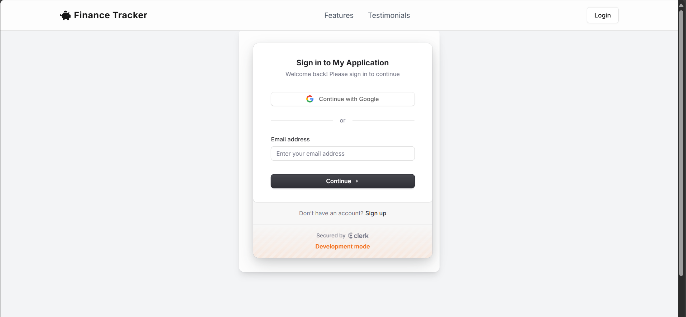
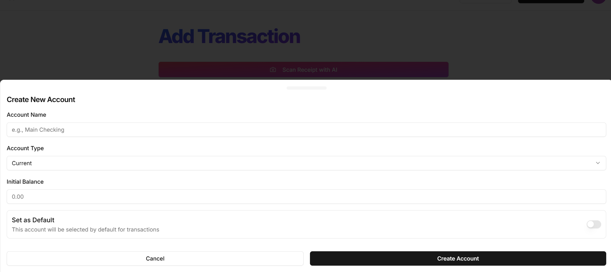
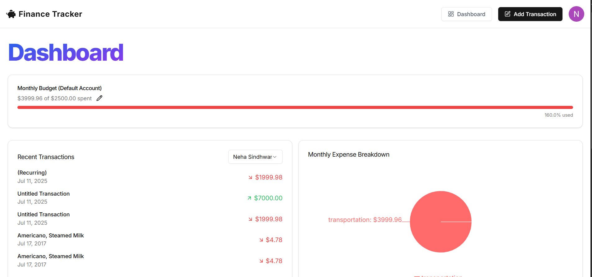
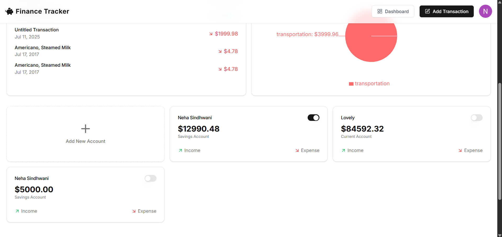
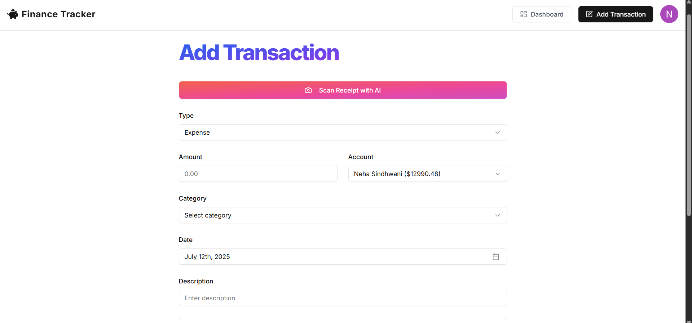
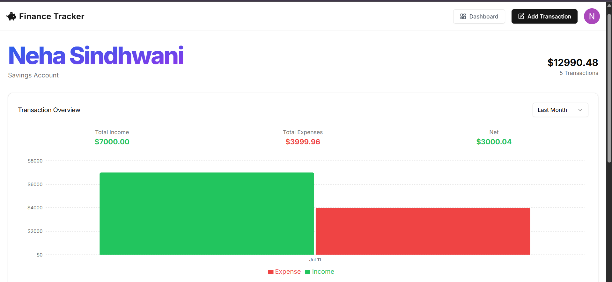
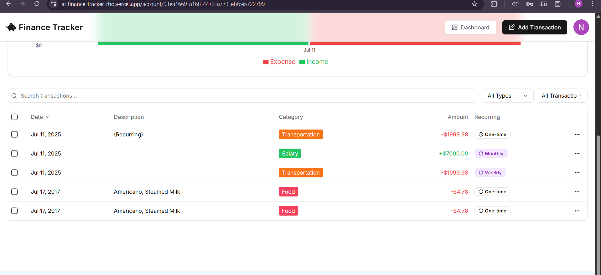

# 💰 AI Finance Tracker

**AI Finance Tracker** is a smart, secure, and scalable finance tracking web application built using modern tools like **Next.js**, **Clerk**, **Inngest**, **Arcjet**, **ShadCN UI**, and **Resend**. It helps users manage their personal finances, track transactions, and receive automated monthly budget insights through emails.

---

## 🔗 Live Demo

👉 [Click here to use the app](https://ai-finance-tracker-rho.vercel.app/)

---

## 📸 Screenshots

### 🏠 Landing Page

### 🔐 Authentication Page

### 📝 Create New Account Page

### 📊 Dashboard

### ➕ Add New Transaction

### 💼 Account Details View

---

## 🚀 Features

- 🔐 **Authentication & User Management** — Powered by [Clerk](https://clerk.dev)
  
- 📩 **Transactional Emails** — Integrated using [Resend](https://resend.com/)
  
- ⏳ **Scheduled Jobs & Background Tasks** — Managed via [Inngest](https://www.inngest.com/)
  
- 🛡️ **App Security & Performance** — Enhanced with [Arcjet](https://arcjet.com/)
  
- 💅 **Modern UI Components** — Styled with [ShadCN UI](https://ui.shadcn.com/)
  
- 🧠 **AI-Powered Finance Suggestions**
  
- 📊 **Income & Expense Tracker**
  
- 📆 **Recurring Transactions**
  
- 📝 **Add, Edit, and Delete Transactions**
  
- 🔍 **Filter & Sort by Date, Category, or Amount**
  
- ⚡ **Fast & Responsive UI** with Next.js 14

---

## 🛠️ Tech Stack

| Technology  | Purpose                                 |
|-------------|------------------------------------------|
| **Next.js** | React-based full stack framework         |
| **Clerk**   | Authentication and user sessions         |
| **Inngest** | Serverless functions & cron jobs         |
| **Arcjet**  | Security and performance shield          |
| **Resend**  | Email service for notifications          |
| **ShadCN UI**| Modern and customizable UI components  |
| **Tailwind CSS** | Utility-first styling               |

---

## 📸 Screenshots

---

## 📦 Getting Started

### 1. Clone the Repository

git clone https://github.com/NehaSindhwani01/AI-Finance-Tracker.git

cd AI-Finance-Tracker

### 2. Install Dependencies

npm install

### 3. Environment Variables

Create a .env.local file and add your keys:

NEXT_PUBLIC_CLERK_PUBLISHABLE_KEY=

CLERK_SECRET_KEY=

RESEND_API_KEY=

INNGEST_EVENT_KEY=

ARCJET_PROJECT_KEY=

### 4. Run the App

npm run dev

---

## 📧 Automated Email Reports

Monthly budget summaries

Personalized AI-based financial tips

Income/Expense analysis

Calendar alerts for upcoming dues

These are sent using Resend + Inngest cron jobs.

---

## 📱 Mobile Ready

Built with a mobile-first approach using Tailwind and ShadCN, ensuring a smooth experience on any device.

## 🧠 Smart Features
Auto-categorization of transactions

AI-driven savings recommendations

Dynamic visual analytics

Goal-tracking and performance summaries

---

## Crafted with ❤️ by Neha Sindhwani
